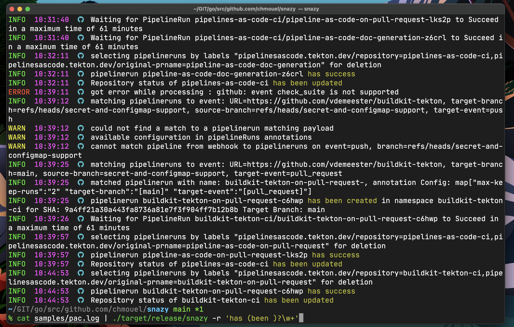
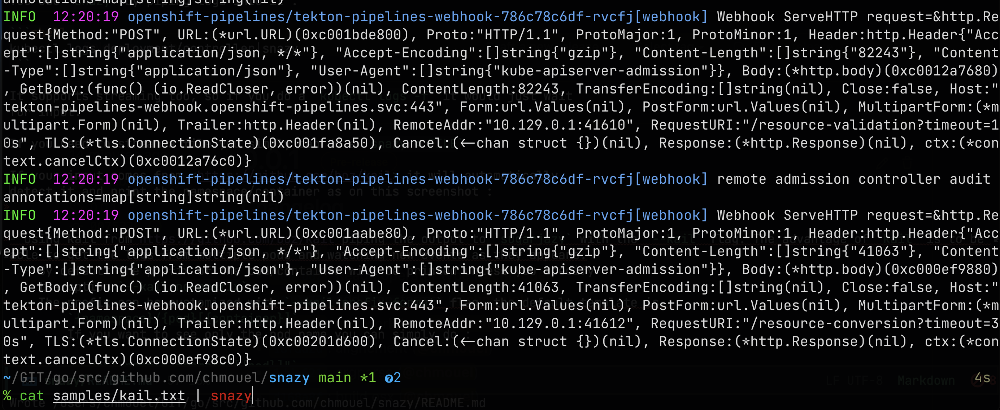
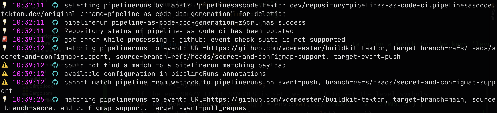

[](https://codecov.io/gh/chmouel/snazy) [](https://crates.io/crates/snazy) [](https://aur.archlinux.org/packages/snazy-bin) [](https://github.com/chmouel/snazy/actions/workflows/rust.yaml) [](https://github.com/pre-commit/pre-commit)

# snazy - a snazzy log viewer

Snazy is a simple tool to parse json or other type of logs and output them in a nice format with
nice colors.

As a [`tekton`](http://tekton.dev) and [`pipelines-as-code`](https://pipelinesascode.com/) developer who has to dig into controller/webhook logs all the time I wanted something that is a bit easier to look in the eyes and identify error/info/warning statements easily.

You do not have to use it only with `tekton` but work well with projects that uses
[`go-uber/zap`](https://github.com/uber-go/zap) library like
[`knative`](https://knative.dev) and many others.

It can work as a super-"[tail](https://man7.org/linux/man-pages/man1/tail.1.html)" too if you want to stream logs and being able to have "actions" or "highlights" on a regexp match.

## Screenshot



## Installation

### [Binaries](https://github.com/chmouel/snazy/releases)

Go to the [release](https://github.com/chmouel/snazy/releases) page and grab
the archive or package targeting your platform.

### [Homebrew](https://homebrew.sh)

```shell
brew tap chmouel/snazy https://github.com/chmouel/snazy
brew install snazy
```

### [Crates.io](https://crates.io/crates/snazy)

```shell
cargo install snazy
```

### [Arch](https://aur.archlinux.org/packages/snazy-bin)

With your favourite aurhelper for example [yay](https://github.com/Jguer/yay) :

```shell
yay -S snazy-bin
```

### [Nix/NixOS](https://nixos.org/)

This repository includes a `flake` (see [NixOS Wiki on
Flakes](https://nixos.wiki/wiki/Flakes)).

If you have the `nix flake` command enabled (currently on
nixos-unstable, `nixos-version` >= 22.05)

```shell
nix run github:chmouel/snazy -- --help # your args are here
```

You can also use it to test and develop the source code:

```shell
nix develop # drops you in a shell with all the thing needed
nix flake check # runs cargo test, rustfmt, …
```

### [Docker](https://github.com/chmouel/snazy/pkgs/container/snazy)

```shell
kubectl logs deployment/pod foo|docker run -i ghcr.io/chmouel/snazy
```

### [Source](https://github.com/chmouel/snazy) install

Snazy is built with rust, if you want to compile it directly you just need to
grab the source and run `cargo build`. (assuming you have the rust tool chain [installed](https://rust-lang.github.io/rustup/installation/index.html))

## Usage

- Usually you use `snazy` by "piping" logs into it :

```shell
kubectl logs deployment/controller|snazy
```

- It supports streaming too. When you have a `kubectl logs -f` it will just wait
  for input and snazzily print your logs from the stream (one line at a time).

- you can pass one or many files on the command line to `snazy` and it will
  parse them rather than using the standard input.

- If you do not pass a file and your input comes from
  <https://github.com/boz/kail> it will automatically detect it and print the
  `namespace/pod[container]` as prefix :



- The flag "--kail-prefix-format" let you customize how to display the kail
  format, the templates `{namespace}`, `{pod}`, `{container}` will be replaced
  by its value and a "\n" will be replaced by a newline. As an example if you
  want to only show the current pod followed by a newline you can use the
  following template:

  `--kail-prefix-format "{pod}\n"`

  the environment variable `SNAZY_KAIL_PREFIX_FORMAT` let you make this setting permanent.

- If you do not any prefix for kail you can pass the `--kail-no-prefix` flag.

- If you want to highlight some patterns you can add the option `-r/--regexp`
  followed by a REGEXP and `snazy` will highlight it. You can have many `-r`
  switches with many regexps, and you get different highlight for each match.

- If you want to have the highlight forced to some colors you can add the color
  at the beginning of the regexp followed by a colon. The colors can be one of
  `yellow`, `red`, `green`, `blue`, `magenta`, `cyan`, `white`, `black` or an RGB
  color model e.g: `88,48,235`. For example if you want to highlight ERROR in red
  and WARNING in yellow you can do:

```shell
% kubectl log pod|snazy -r red:ERROR -r yellow:WARNING -r green:INFO -r 88,48,235:MITIGATED
```

- If `snazy` don't recognize the line as JSON it will simply straight print
  it. Either way it will still apply regexp highlighting of the `-r` option or
  do the action commands matching (see below). This let you use it for any logs
  to do some regexp highlighting and action on pattern.

- If you want to only show some specific levels, you can add the flag
  `-f`/`--filter-levels` to filter by level or many `-f` for many levels, for
  example, this only show warning and error from the log:

```shell
% kubectl log pod|snazy -f warning -f error
```

- If you pass the flag `-l/--level-symbols` or set the environment variable
  `SNAZY_LEVEL_SYMBOLS`, snazy will show some pretty emojis rather than plain log
  level label :



- You can customize the time printed with the `--time-format` flag (or the environment
  variable `SNAZY_TIME_FORMAT`), the variable respect the UNIX
  [`strftime`](https://man7.org/linux/man-pages/man3/strftime.3.html) format
  strings.

- If you want to skip showing some lines you can specify the flag
  `-S/--skip-line-regexp`. When it matches the word or regexp in
  this value it will simply skipping printing the line. You can have multiple flags
  if you want to skip multiple lines.

- You can do your own field matching with the `-k/--json-keys` flag, you need to pass the fields `msg`, `level` and `ts`.
  The fields target a key in a json payload specified as [JSON Object notation](https://www.rfc-editor.org/rfc/rfc6901). The description of the fileds are:

  - `msg`: The message text (string)
  - `level`: The log level (eg: info) (string)
  - `ts`: The timestamp, a float or a datetime.

  If any of those fields are missing the parser will fails.

  **Example**:

  ```shell
  echo '{"the": {"msg": {"is": "message"}, "level": {"is": "INFO"}, "ts": [{"is": "2022-04-25T14:20:32.505637358Z"}]}}' | \
        snazy -k msg=/the/msg/is -k level=/the/level/is -k ts=/the/ts/0/is
  # => INFO  14:20:32 message
  ```

- Snazy support action command on regexp, which mean if you have a regexp
  matching a message it will run an action on it. It currently supports only one
  action one regexp. If you specify the string `"{}"` it will be expanded to
  the matched string. For example on MacOS this command will display a
  notification with the pipelinerun that has succeeded:

  ```shell
  snazy --action-regexp "pipelinerun(s)?\s*.*has success" --action-command "osascript -e 'display notification \"{}\"'"
  ```

## Interactive filtering with fzf

You can go even further with UNIX shell pipelines, and feed snazy to fzf for interactive filtering of the stream. for example to stream everything on a kubernetes cluster with kail, transforming the logs via snazy and finally using fzf to interactively select the patter to match:

```shell
kail --since=1h | snazy | fzf +s --ansi
```

This will give you a prompt with [`fzf`](https://github.com/junegunn/fzf) where you can type the query you want.

## Show GitHub Action Runs logs with snazy

An handy script located [here](./misc/gh-run-logview-snazy) let you show the log
of a GitHub action runs through snazy and the
[`bat`](https://github.com/sharkdp/bat) pager.

You will need to setup the [gh cli](https://github.com/cli/cli) and install
[fzf](https://github.com/junegunn/fzf) to make it works.

Here is a video showing the feature <https://streamable.com/7sf1hq>

## Shell completions

Shell completions are available for most shells using the command `--shell-completion` for example `--shell-completion=zsh`. Many different shell are supported. I let the reader figure out how to use them with their respective shells. Brew and RPM packages should have them auto configured for bash/fish/zsh.

## FAQ

- I have seen a tool like that before with another stupid name? I used to have a python script that does the same and more called
  ([sugarjazy](https://github.com/chmouel/sugarjazy)) but I wanted to experiment with Rust, so I called this one
  [snazy](https://www.urbandictionary.com/define.php?term=snazy).
- You missed a z to snazzy. True that. But snazy is easier to google than snazzy :p
- Why rust? Good question, I guess i'll go by why not? it's kinda nice to program high level cli with low level language easily.
  [sharkdp/fd](https://github.com/sharkdp/fd)

## Copyright

[Apache-2.0](./LICENSE)

## Authors

Chmouel Boudjnah <[@chmouel](https://twitter.com/chmouel)>
