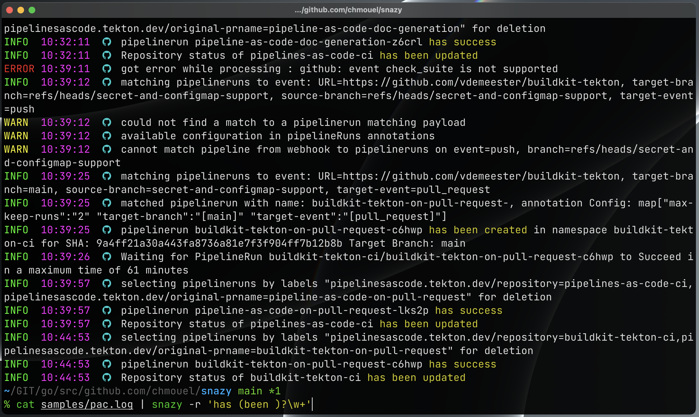

[](https://crates.io/crates/snazy) [](https://aur.archlinux.org/packages/snazy-bin) [](https://github.com/chmouel/snazy/actions/workflows/rust.yaml)  [](https://github.com/pre-commit/pre-commit)

# snazy - a snazzy json log viewer

Snazy is a simple tool to parse json logs and output them in a nice format with
nice colors.

As a [`tekton`](http://tekton.dev) developer who has to dig into controller/webhook logs I wanted
something that is a bit easier to look in the eyes and identify error/info/warning statements easily.

It's not only for `tekton` but would work well with projects using [`go-uber/zap`](https://github.com/uber-go/zap) library like [`knative`](https://knative.dev) and many others.

## Screenshot



## Installation

### [Binaries](https://github.com/chmouel/snazy/releases)

Go to the [release](https://github.com/chmouel/snazy/releases) page and choose
your archive or package for your platform.

### [Arch](https://aur.archlinux.org/packages/snazy-bin)

With your favourite aurhelper like [yay](https://github.com/Jguer/yay) :

```shell
yay -S snazy-bin
```

### [Homebrew](https://homebrew.sh)

```shell
brew tap chmouel/snazy https://github.com/chmouel/snazy
brew install snazy
```

### [Crates.io](https://crates.io/crates/snazy)

```shell
cargo install snazy
```

### [Docker](https://github.com/chmouel/snazy/pkgs/container/snazy)

```shell
kubectl logs deployment/pod foo|docker run -i ghcr.io/chmouel/gosmee
```

## Build from [source](https://github.com/chmouel/snazy)

Snazy is using rust, if you want to compile it directly you just need to
checkout the source and run `cargo build`.

## Usage

You use `snazy` by "piping" logs into it :

```shell
kubectl logs deployment/controller|snazy
```

It supports streaming too. When you have a `kubectl logs -f` it would just wait
for input and snazzily print your logs.

If you need to parse a file you simply can use the shell with `snazy < FILE`

If your input comes from <https://github.com/boz/kail> it will automatically
detect it and print the namespace/pod[container] :


If you don't want to have the namespace/pod[container] printed you can add the
flag `--kail-no-prefix`.

If you want to highlight some pattern you can add the option `-r REGEXP` and
`snazy` will highlight it. You can have multiple `-r` switches with multiple
regexps and you get different highlight for each match.

If you want to only show some levels, you can add the -f option with level
separated by commas, for example:

```shell
% kubectl log pod|snazy -f warning,error
```

will only show warning and error fro the log.

You can customize the time printed with the `-t` option which respect the
[`strftime`](https://man7.org/linux/man-pages/man3/strftime.3.html) format
strings.

## Shell completions

Shell completions is available for most shells in the [misc/completions](./misc/completions) and it should be automatically installed with the aur/brew package.

## FAQ

- I have seen a tool like that before with another stupid name? I used to have a python script that does the same and more called
  ([sugarjazy](https://github.com/chmouel/sugarjazy)) but I wanted to experiment with Rust so I called this one
  [snazy](https://www.urbandictionary.com/define.php?term=snazy).
- You missed a z to snazzy... true that... but snazy is easier to google than snazzy :p
- Why rust? Good question, it seems the kids like it but i still don't get it,
  maybe one day I will but it really take a few years to dig a programming
  language.

## Copyright

[Apache-2.0](./LICENSE)

## Authors

Chmouel Boudjnah <[@chmouel](https://twitter.com/chmouel)>
